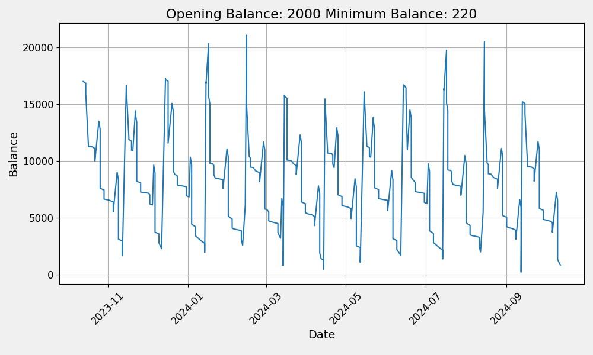

# cash flow projector

This is a utility project designed to forecast the cashflow in a clearing account to ensure it doesn't deplete and leave insufficient funds for direct debits.

A clearing account receives income before it is disbursed to spending and savings accounts and direct debits. The goal is to automate this account to maintain the minimum necessary cash.

Use this project to calculate the starting balance and confirm a stable budget, that doesn't trend up or down and can span those months with 5 weeks. 

## basic docker usage
Copy the `app/config.yml.example` to `app/config.yml` and update it with your weekly, fortnightly or monthly income and disbursements. 

run containers (daemonised)
```
docker-compose up
```

This will output a transaction list and generate a chart like so



This image need to be copied out of the container from `app/output.png` unless your are mapping the app volume to your local host.  See below.

## developing with docker on osx

Note the override file that mounts your app volume with :delegated
```
cp docker-compose.override.yml.example docker-compose.override.yml
```

The provided docker-compose.override.yaml.example file will not actually run your app.  Instead it runs docker-start.override that hangs the container to leave it running so you can shell in and run your application yourself.  This makes debugging easy.  

Shell into the python app container
```
docker-compose exec app /bin/bash
```

Once shelled in you can run `python3 start.py` etc...
